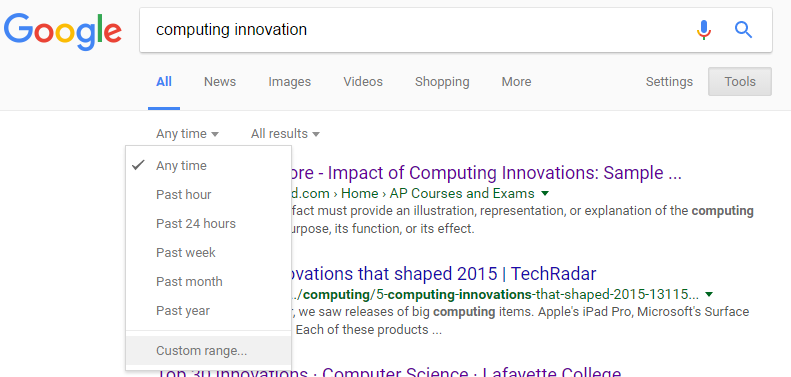
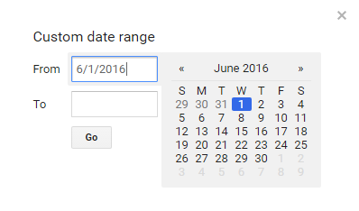
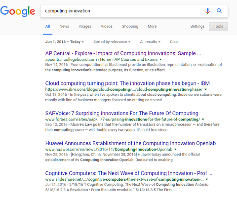

# Explore Performance Task
See the [College Board handout](http://lhs-sfusd-ca.schoolloop.com/file/1468166350956/1239686294988/2264421825106539061.pdf) for details. You will be given 8 hrs of class time from November 28th until the end of class on Thursday December 15th to complete this assignment. You will submit your computational artifact (e.g. infographic) and your answers to the four prompts and citations on the College Board template.
 
Your completed explore performance task is due by the end of class on Thursday December 15th. Your submission will be graded on the 7 point scale used by the college board. For each of the 7 points there is no partial credit. Note that the 7 points are weighted:   
1. Artifact 20%
2. Plausible Fact 10%
3.  One effect 15%
4. Benefit AND harm 15%
5. Identify data 15%
6. Data concern 15%
7. Citations 10%
 
Submissions without at least 3 sources will not be accepted and will be returned to you. Make sure you _cite at least 3 of your references_ in your written responses. To get sources that have been written since June 2016 limit your Google search results to recent web sites. Click on *Tools* and then choose *Custom Range*.   
   
Then click enter *6/1/2017* in the *From* field. Click *Go*.   
   
Notice that your search results will all have a date listed.   
   
If you are having trouble establishing a date for a web site, try [Carbon Dating the Web](http://cd.cs.odu.edu/).
 
Be sure to describe how you got any pictures for your artifact in your answer to 2b.
 
Avoid the word "hack" when describing your data concern in part 2d. Instead, be specific and describe how there might be a problem with the data of your computing innovation. Look at the high scoring examples for ideas. Stating a data privacy concern, such as hacking, without an analysis that connects the concern to the computing innovation and a description of how the obtained data might be used to violate privacy rights will not get point number 6 for the data concern.
 
Also note that hacking is not a harmful effect of a computing innovation and should not be part of your answer to 2c.
 
Use the College Board template to write your answers to the four prompts. Save your finished template as a pdf (in Microsoft Word, choose *File | Export* and choose *Create pdf/xps document*) The College Board recommends that you do not put your name on your artifact or on the template. Submit your computational artifact and template by logging in at [digitalportfolio.collegeboard.org](http://digitalportfolio.collegeboard.org). There is more information on how to use the digital portfolio website in the [college board student guide](https://secure-media.collegeboard.org/digitalServices/pdf/ap/computer-science-principles-digital-portfolio-student-guide.pdf).
 
<h2>Common Mistakes:</h2>   
+ For full credit you will want to avoid these common mistakes:
+ 2a: Make sure to explain why your innovation is "computational" meaning that is uses computers or computing devices (e.g. smartphones)
+ 2b: Say where you got images (e.g. Google image search or Canva image bank)
+ 2c: Do NOT use hacking or cost as a harmful effect. A harmful effect should be a specific result of your innovation.
+ 2d: Avoid the words hacking, hacked or hack. Be specific about your data concern and how the data in your innovation could be problematic or misused.
+ 2e: Make at least 3 inline references to 3 different citations. 2 sources need to be from June 2017 or later. See the instructions above on how to limit search results in google to June 2016 or later.
